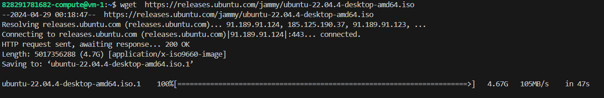
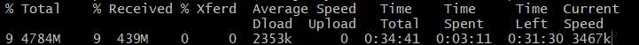
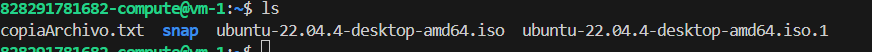
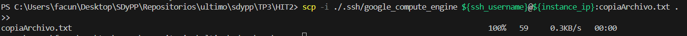

### Generacion de instancias 

```
provider "google" {
  credentials = file(var.credentials_file_path)
  project     = var.project_id
  zone        = var.zone
  region      = var.region
}

data "google_client_openid_userinfo" "me" {}


resource "google_compute_instance" "pruebavm" {
  count         = var.instancias
  name          = "vm-${count.index + 1}"
  machine_type  = var.tipo_vm
  zone          = var.zone

  boot_disk {
    initialize_params {
      image = var.imagen
    }
  }

  network_interface {
    network = "default"
    access_config {}
  }

```
### Utilice #user_data para instalar paquetes (wget, htop, etc) en sus servidores Linux como defecto.
```
metadata_startup_script = <<-EOF
    #!/bin/bash
    apt-get update
    apt-get install -y wget htop
  EOF


```

### Cree reglas de seguridad para acceder a puertos necesarios en las instancias (ssh 22, http 80, https 443)

```
resource "google_compute_firewall" "allow-ssh" {
  name    = "allow-ssh"
  network = "default"

  allow {
    protocol = "tcp"
    ports    = ["22"]
  }

  source_ranges = ["0.0.0.0/0"]
}

resource "google_compute_firewall" "allow-http" {
  name    = "allow-http"
  network = "default"

  allow {
    protocol = "tcp"
    ports    = ["80"]
  }

  source_ranges = ["0.0.0.0/0"]
}

resource "google_compute_firewall" "allow-https" {
  name    = "allow-https"
  network = "default"

  allow {
    protocol = "tcp"
    ports    = ["443"]
  }

  source_ranges = ["0.0.0.0/0"]
}
```

### Configure SSH para poder acceder al servidor:
```
resource "tls_private_key" "ssh_key" {
  algorithm   = "RSA"
  rsa_bits    = 4096
}
resource "local_file" "ssh_private_key_pem" {
  content         = tls_private_key.ssh_key.private_key_pem
  filename        = ".ssh/google_compute_engine"
  file_permission = "0600"
}
```


### El nombre de la instancia y del usuario se obtiene de OUTPUTS.tf

```
output "instance_ip" {
  value = google_compute_instance.pruebavm [0].network_interface[0].access_config[0].nat_ip
}


output "ssh_username" {
  value       = split("@", data.google_client_openid_userinfo.me.email)[0]
  description = "Los nombres de usuario SSH para conectarse por SSH a las instancias."
}

```


### Conexión ssh
```
$instance_ip = terraform output -raw instance_ip
$ssh_username = terraform output -raw ssh_username  
ssh -i ./.ssh/google_compute_engine "${ssh_username}@${instance_ip}"

```

### Conéctese por ssh y haga un wget de un archivo grande (por ejemplo ISO de ubuntu: https://releases.ubuntu.com/jammy/ubuntu-22.04.2-desktop-amd64.iso) desde su pc y uno desde la instancia virtual.  Compare y comente las velocidades de descarga. ¿A qué se debe esta diferencia?
Descarga en vm: 


Descarga local:



Se puede observar que cuando realizamos la descarga en la vm tarda 47 segundos mientras que localmente habiendo trascurridos 3 minutos a penas se recivieron 438MB de los 4784MB.

Esta diferencia puede deberse al ancho de banda de red de alta velocidad que utiliza la VM de Google Cloud y a las limitaciones que puede tener nuestra red como el ancho de banda contratado, la congestion de la red, etc.
Otra de las causas puede deberse a la ubicacion de los servidores que almacenan los archivos que se estan descargando, gcloud puede tener sus servidores geograficamente mas cerca que nuestra maquina local.

### Copia de archivos con scp
 
#### De local a vm

```
scp -i ./.ssh/google_compute_engine ./copiaArchivo.txt ${ssh_username}@${instance_ip}: 
```


#### De vm a local
```
scp -i ./.ssh/google_compute_engine ${ssh_username}@${instance_ip}:copiaArchivo.txt . 

```
