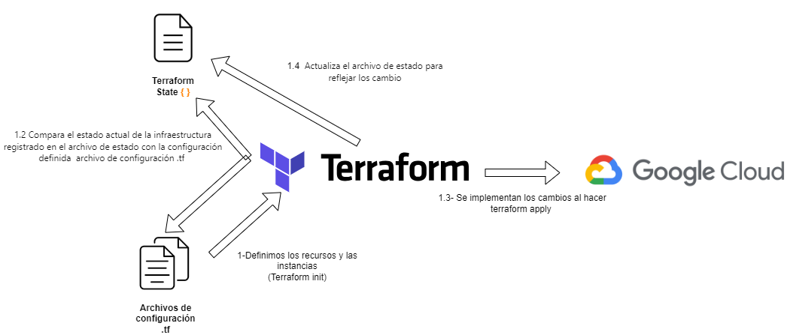
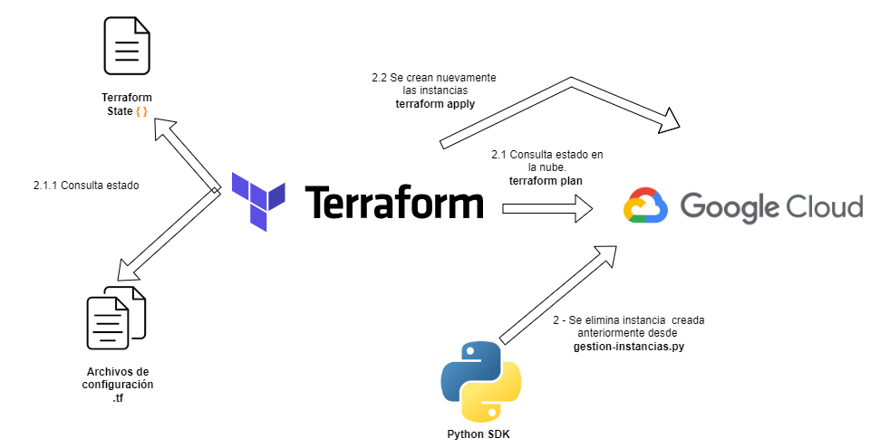
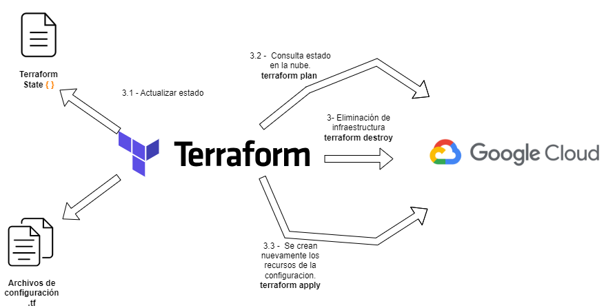

# Preguntas

## ¿Qué pasa con el estado de terraform si hago terminate?

Cuando ejecutas terraform destroy , Terraform marca los recursos para eliminarlos. El estado de Terraform se actualiza para reflejar que esos recursos están programados para ser eliminados.

### Explicar qué pasa cuando vuelvo a correr Terraform plan / apply

## Hacer un dibujo explicativo de lo sucedido.

### 1 - Creamos las instancias

### 2- Elimnacion de instancias desde SDK de python 

Al eliminar instancias por fuera de terraform con el sdk de python,terraform comparara el estado actual de la infraestructura con lo que está definido en la configuración y en el archivo de estado. Si hay diferencias entre lo que Terraform espera y lo que realmente existe en la nube, Terraform va a intentar que la infraestructura coincida con la definición en la configuración, lo que va a resultar en la creacion de la vms eliminadas.

### 2- Elimnacion de la infraestructura con terraform terminate 

Al ejecutar terraform destroy por linea de comandos Terraform eliminará los recursos definidos en la configuración y actualizará el archivo de estado para reflejar los cambios. Es decir que, después de ejecutar terraform destroy, los recursos que se eliminaron ya no estarán presentes en el archivo de estado.
Si ejecutamos terraform plan después de haber ejecutado terraform destroy, Terraform detectará que los recursos definidos en el archivo de configuración ya no existen en google cloud y  Terraform mostrará que todos los recursos que fueron destruidos en la ejecución anterior se crearán nuevamente.

Después de ejecutar terraform apply, Terraform implementará los cambios necesarios según lo definido en el archivo de configuración.