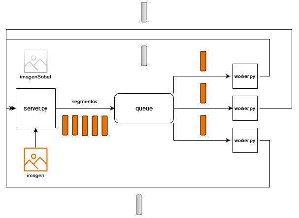

## PART II 

Desarrolle este proceso de manera distribuida donde se debe partir la
imagen en n pedazos, y asignar la tarea de aplicar la máscara a N procesos
distribuidos. Después deberá unificar los resultados.
A partir de ambas implementaciones, comente los resultados de performance
dependiendo de la cantidad de nodos y tamaño de imagen.

## PART III

Mejore la aplicación del punto anterior para que, en caso de que un proceso
distribuido (al que se le asignó parte de la imagen a procesar - WORKER) se caiga y no responda, el proceso principal detecte esta situación y pida este
cálculo a otro proceso.

## Diagrama

## Funcionamiento

[1] El servidor parte la imagen en n segmentos, publica cada segmento en la cola para que los workers los consuman.

[2] Los workers se conectaran a la cola para consumir segmentos de imagenes. Cuando la cola tenga segmentos para consumir cada worker aplicara el filtro sobel al semento y se lo enviara al servidor.

[3] El servidor quedara esperando recibir la cantidad n de segmentos que envio. Cuando reciba la totalidad de segmentos ordenara y unificara cada uno de ellos para volver a formar la imagen.
