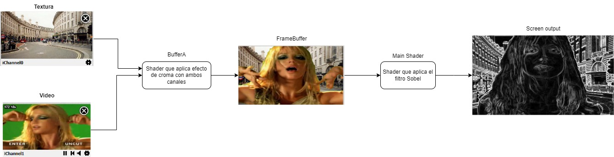

# HIT 8

El pipeline de renderizado se explica en el siguiente diagrama:

En un Buffer se procesan ambos canales en los que quiero aplicarles el croma, el color verde de Britney Spears se hara transparente y se le aplicara la textura.
Luego simplemente el resultado de esto se usa como entrada en el main Shader en la cual se aplica el filtro Sobel. En este caso funciona porque el Sobel se le aplica
directamente a una sola salida y no como anteriormente se debia aplicar al color transparente del video lo cual no tenia mucho sentido.
Los FPS dependen de la tasa de refresco del monitor, en mi caso a 165 FPS
