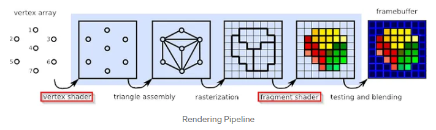

# Informe

## Tipos de Shaders

### 2D

Los shaders 2D tambien son conocidos como texturas y son usados para renderizar geometria 3D.
El unico tipo de Shader 2D es el **Pixel Shader**, que se conocen como fragmentos de shaders. Los mas simples de este tipo son
los que se encargan de producir un pixel como un solo color, y es capaz de aplicarle a ese color un valor de iluminacion, y otros efectos como
Bump Mapping (Mapeado topologico), aplicar sombras, transparencia, etc. Ademas puede alterar la profundidad (Eje Z) del fragmento.
En graficos 3D, un fragmento solo no puede producir estos efectos complejos porque opera en singular, sin conocimiento de la geometria que lo rodea.
Sin embargo, en conjunto pueden acceder a las coordenadas de la pantalla que están siendo dibujadas y pueden muestrear la pantalla y los píxeles cercanos
si se pasa el contenido de toda la pantalla como una textura al shader. Esta técnica permite una amplia variedad de efectos de postprocesamiento en 2D.

### 3D

Los shaders en 3D actúan sobre modelos tridimensionales y pueden acceder a los colores y texturas que se usan para dibujar el modelo o mesh.

Los **Vertex Shaders** se ejecutan una vez por cada vértice enviado a la GPU.
Los vertex shaders transforman la posición 3D de cada vértice en el espacio virtual en coordenada 2D de la pantalla.
Pueden manipular propiedades como la posición, el color y las coordenadas de la textura, pero no pueden crear nuevos vértices.

Los **Geometry Shaders** pueden generar nuevos primitivas gráficas, es decir formas geometricas simples como puntos, líneas o triángulos,
a partir de las primitivas enviadas al pipeline grafico. Se ejecutan después de los vertex shaders y toman como entrada una primitiva, como un triángulo.
Luego, el shader puede emitir cero o más primitivas, la cual son convertidos en pixeles y sus fragmentos pasan al pixel shader.

Los **Tessellation Shaders** agregan dos etapas al proceso: tessellation control shaders y los tessellation evaluation shaders.
Estos permiten subdividir meshes simples en meshes más finas en tiempo real con una función matemática.
Permite que mientras mas cerca estes de un objeto mas detalle tiene, mientras que los más alejados pueden tener meshes más gruesas sin perder calidad.
También reducen el ancho de banda requerido para las meshes.

Los **Primitive Shaders**, similares a los compute shaders pero con acceso a los datos necesarios para procesar geometría.
Nvidia introdujo los **mesh** y task shaders permitiendo al GPU manejar algoritmos más complejos y aliviando la carga del CPU.

Los **Compute Shaders**  pueden integrarse en pipelines de renderizado para etapas adicionales en algoritmos de animación o iluminación.

Para renderizar graficos en 3D, se utiliza una secuencia llamada Pipeline de renderizado utilizando una API llamada WebGL,
la cual es usada para crear estos graficos en un navegador. El pipeline de renderizado es una secuencia de pasos que hace WebGL al renderizar usando
unidades de procesamiento de nuestra GPU.



En esta imagen se pueden ver esta secuencia de etapas.
Las etapas de vertex shader y fragment shader son las que explique anteriormente, y pueden ser programados por nosotros.

Las tres primeras etapas involucran un espacio 3D.
La etapa de Vertex Array definen de los vértices en un espacio 3D, luego Vertex Shader aplica una transformacion a los vértices en ese espacio 3D.
Despues Triangle Assembly ensambla de los vértices en triángulos que conforman la geometría 3D.
La Rasterization convierte los triángulos 3D en fragmentos 2D, osea en pixeles. Fragment Shader procesa cada fragmento y determina su color y otros atributos.
Por ultimo el Testing and Blending realiza pruebas y mezclas de colores para determinar el color final de cada píxel en el framebuffer.

### Post-Processing

El post-procesado se usa para el renderizado 3D. Antes de renderizar objetos 3D en la pantalla, primero se renderiza en una memoria buffer
en la GPU. Luego se usan pixel y vertex shaders para aplicarle un filtro post-procesado al buffer antes de moestrarlo. Esto permite aplicar
efectos como el Blur, Anti-aliasing, Bloom, etc, cuyos efectos pueden requerir multiples pasadas y que requieren conocer la imagen completa.

## Shadertoy

### Parametros posibles de entrada para un shader

- iResolution: Vector de 3 valores que establecen en pixeles la resolucion del viewport
- iTime: Valor flotante que establece el tiempo en segundos que se va a reproducir el shader
- iTimeDelta: Valor flotante que establece en segundos el tiempo de renderizado entre frames consecutivos
- iFrameRate: Valor flotante que establece la tasa de frames del shader por segundo (fps)
- iFrame: Valor entero que cuenta cuantos frames se renderizaron desde el inicio
- iChannelTime[4]: Valor flotante que representa el tiempo de reproduccion de cada canal en segundos. Puede haber hasta 4 canales
- iChannelResolution[4]: Vector de 3 posiciones que representa la resolucion de cada canal en pixeles
- iMouse: Vector de 4 posiciones que representan las coordenadas del mouse y si se hizo click
- iChannel0..3: De tipo samplerXX, donde XX puede ser 2D o Cube. Representan canales de entrada
- iDate: Vector de 4 posiciones que representa el año, mes, dia y hora

### Salidas posibles de shaders

- Imagen: Vector de 4 posiciones que representa el color del píxel actual en formato RGBA (Rojo, verde, azul y transparencia)..
- Sonido: Vector de 2 posiciones que representa el sonido en estéreo, es decir, dos valores para los canales izquierdo y derecho.
- Realidad Virtual: Vector de 4 posiciones que devuelve el color del píxel actual, los rayos de origen y la dirección para la realidad virtual.

## Explicacion el codigo

```glsl
void mainImage( out vec4 fragColor, in vec2 fragCoord )
{
    // Normalized pixel coordinates (from 0 to 1)
    vec2 uv = fragCoord/iResolution.xy;

    // Time varying pixel color
    vec3 col = 0.5 + 0.5*cos(iTime+uv.xyx+vec3(0,2,4));

    // Output to screen
    fragColor = vec4(col,1.0);
}
```

El codigo es una funcion que recibe las coordenadas del fragmento y devuelve el color final del pixel en RGBA
Luego calcula las coordenadas normalizadas dividiendo las coordenadas del fragmento por la resolución de la pantalla y las guarda en uv, teniendo un rango de 0 a 1.
Normalizar las coordenadas facilita la creacion de efectos independientemente de la resolucion de la pantalla. Usar xy puede hacer que los efectos sean inconsistentes.
Luego en col que es un vector de 3 posiciones se guarda el resultado de una operacion aritmetica que permite que el color varie con el tiempo,
Incluyendo la variable iTime en la operacion hace que los colores estaticos que se usan cambien con el tiempo, creando una animacion.
col es un vector de 3 porque uv.xyx convierte uv en un vector con componentes x,y,x (se repite el valor de x), y luego las operaciones con un solo valor se aplican a todo los 3 componentes del vector.
Ls componentes de fragColor representan los colores RGBA (Rojo, Verde, Azul, Alpha). En este caso vec4 se puede construir como (x, y, z, w) o (r, g, b, a). En este caso lo esta construyendo con los valores de col que es un vec3, y le agrega un ultimo componente que es el Alpha, dando como resultado un vec4.
Los vectores se pueden construir de las siguientes formas:

- vec2: (x, y) o (r, g)
- vec3: (x, y, z) o (r, g, b)
- vec4: (x, y, z, w) o (r, g, b, a)

Que pueden representar coordenadas o colores. En vec4 el "a" en el color representa la transparencia como mencione antes, y la "w" como coordenada puede representar coordenadas homogeneas
